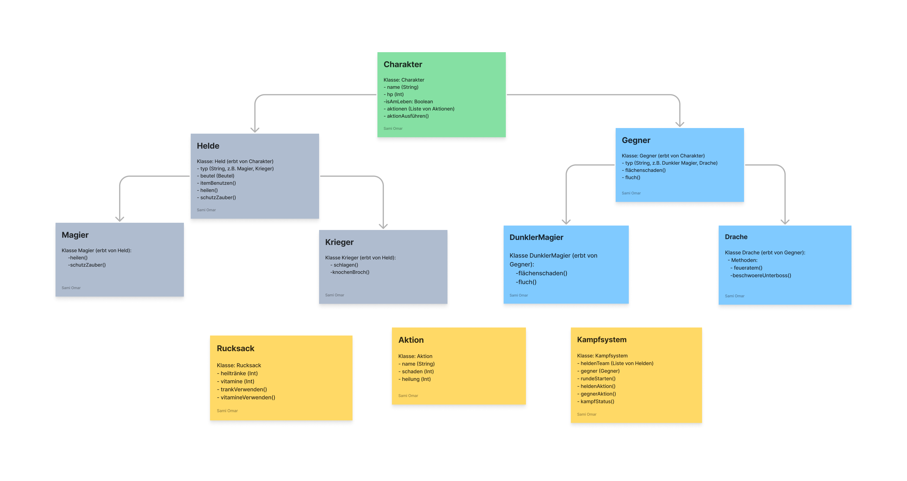

<h1 align="center">Grundlagen der Programmierung</h1>
<h3 align="center">Golden Syntax Spiel</h3>
<h4 align="center">Klassendiagramm</h4>
 

  

<h1 style="color: #005780;" align="center">One Piece Fantasie-Kampfarena - Spielanleitung & Features</h1>

<h2 style="color: #1034A6;">Spielanleitung</h2>

Starte dein One Piece Abenteuer in dieser rundenbasierten Kampfarena. Wähle deine Crew aus ikonischen Charakteren und meistere Kämpfe gegen berühmte Gegner der Serie.

<h3 style="color: #FBB917;">Spielstart</h3>
<ul>
<li><strong>Öffne das Spiel:</strong> In der Kommandozeile beginnt dein Abenteuer.</li>
<li><strong>Crew zusammenstellen:</strong> Wähle Charaktere wie Ruffy oder Zorro mit spezifischen Fähigkeiten.</li>
</ul>

<h3 style="color: #FBB917;">Rundenablauf</h3>
<ul>
<li><strong>Aktion wählen:</strong> Jeder Charakter hat eine Aktion pro Runde.</li>
<li><strong>Kampfhandlung:</strong> Aktionen werden ausgeführt, Gegner reagieren.</li>
<li><strong>Status prüfen:</strong> Überwache die Gesundheit und spezielle Zustände.</li>
</ul>

<h3 style="color: #FBB917;">Siegbedingungen</h3>
<ul>
<li><strong>Besiege alle Gegner:</strong> Sei der letzte, der auf dem Schlachtfeld steht.</li>
</ul>
