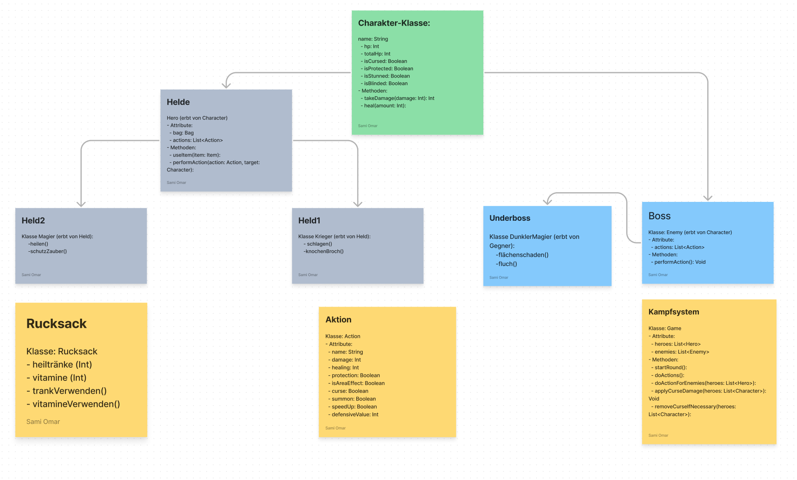

<h1 align="center">Grundlagen der Programmierung</h1>
<h3 align="center">Golden Syntax Spiel</h3>
<h4 align="center">Klassendiagramm</h4>
 

  

# Golden Syntax: Ein One Piece Text-Kampfspiel

Willkommen bei Golden Syntax, einem aufregenden Text-basierten Kampfspiel, das im Universum der beliebten Serie "One Piece" angesiedelt ist. Stellen Sie Ihr Team aus heldenhaften Charakteren zusammen und stellen Sie sich den Herausforderungen gegen eine Vielzahl von Gegnern.

## Spielregeln

Im Herzen von Golden Syntax liegt eine rundenbasierte Kampfdynamik, in der die richtige Taktik und Teamzusammenstellung über Sieg oder Niederlage entscheiden. Hier sind die Spielregeln im Detail:

1. **Helden Auswahl:**
   Beginnen Sie jedes Gefecht mit der Auswahl der Helden, die gegen das gegnerische Team antreten sollen.

2. **Aktionen und Runden:**
    - Jeder Held hat ein Arsenal von vier Aktionen zur Verfügung, um in seinem Zug anzugreifen oder zu verteidigen.
    - Zusätzlich zu ihren Aktionen hat jeder Held einmal pro Spiel einen Rucksack mit heilenden und stärkenden Gegenständen zur Verfügung.

3. **Kampfablauf:**
    - Die Helden Ihres Teams führen ihre Aktionen nacheinander aus.
    - Nachdem alle Helden agiert haben, ist das gegnerische Team an der Reihe, ihre Angriffe durchzuführen.
    - Sobald beide Teams ihre Züge gemacht haben, beginnt eine neue Runde.

4. **Spielende:**
   Das Spiel endet, wenn alle Mitglieder eines Teams besiegt sind. Die Überlebenden werden als Sieger gekrönt.

5. **Strategie:**
   Entscheidend ist, wie Sie Ihre Helden und deren Aktionen koordinieren. Die richtige Reihenfolge und das Timing der Angriffe, kombiniert mit dem klugen Einsatz des Rucksacks, können über das Schicksal Ihres Teams entscheiden.

